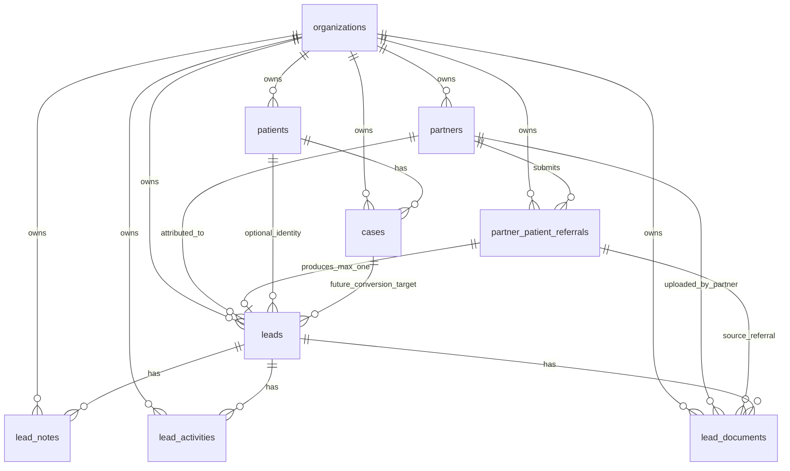
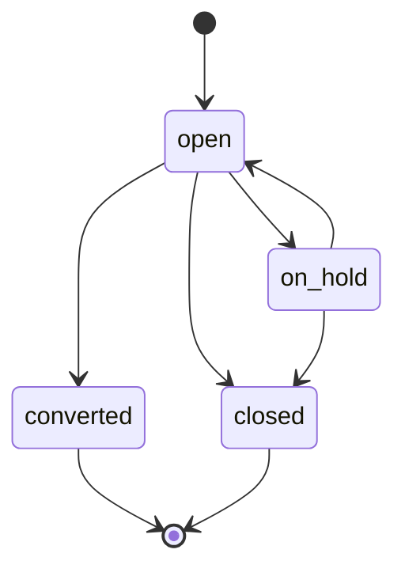
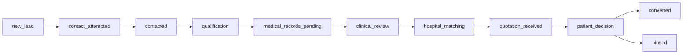
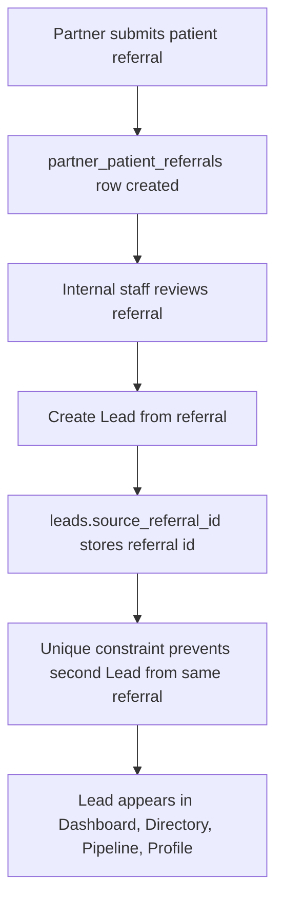
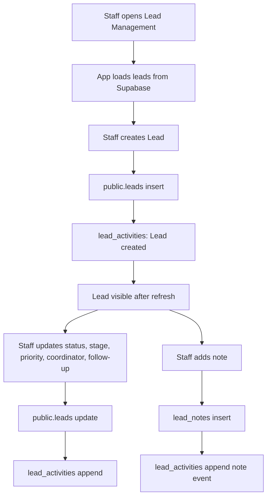
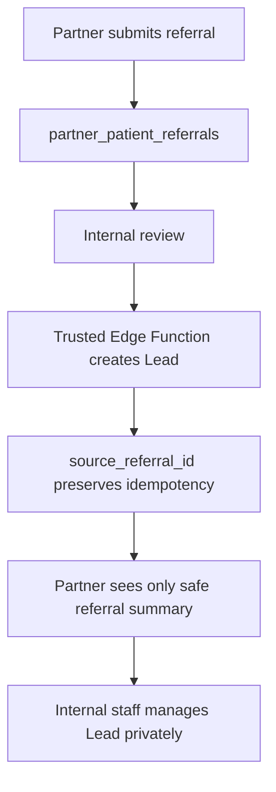
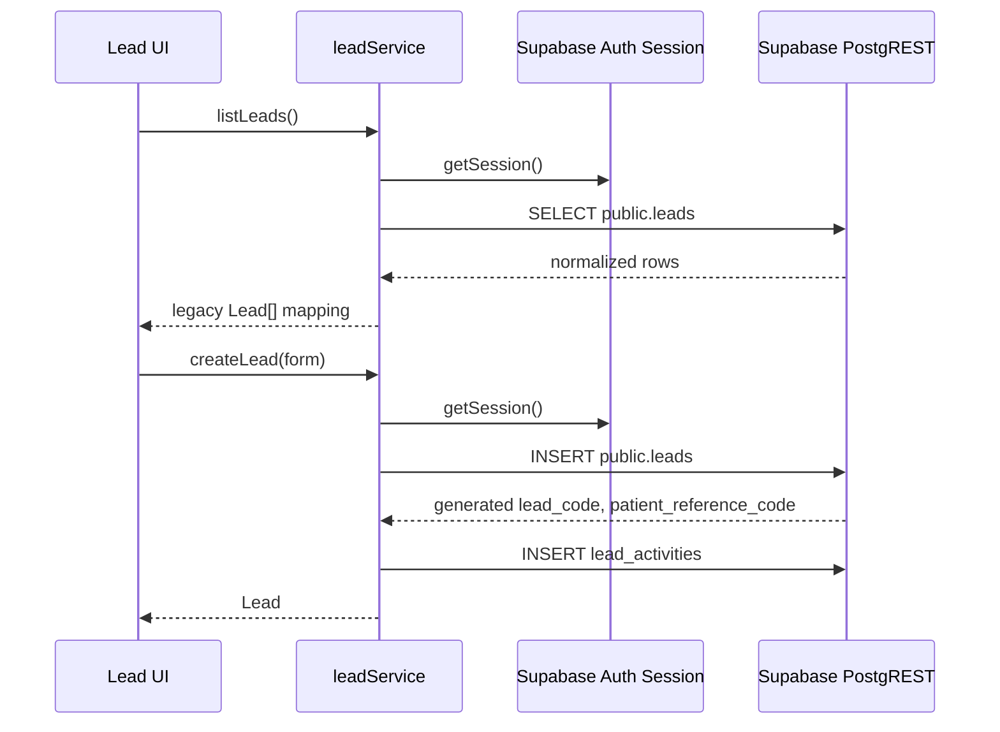

# Lead Management Technical Design

Status: Approved

Approval date: 2026-07-19

Related feature branch: `feature/supabase-leads-backend`

Scope: Lead Management Foundation

Architecture decision summary:

The existing Lead Management module will become Supabase-backed without creating a second CRM, intake system, or pipeline. `public.partner_patient_referrals` remains the original partner submission and attribution record. `public.leads` becomes the internal AfraMedico operational Lead record. One partner referral may produce a maximum of one Lead through `leads.source_referral_id = partner_patient_referrals.id`. Internal staff access is organization-scoped through existing RLS conventions. Partner Portal users receive no direct access to internal Lead data.

## Purpose

Create the first production-ready backend foundation for the existing Lead Management module without creating a second intake, pipeline, CRM, or referral system.

Core principle:

`partner_patient_referrals` remains the original partner submission and attribution record.

`leads` becomes the internal AfraMedico operational Lead record.

One Partner Referral may produce maximum one Lead.

## 1. Database ER Diagram



## 2. Foreign Keys

### `leads`

- `organization_id` -> `organizations(id)`
- `patient_id, organization_id` -> `patients(id, organization_id)` nullable
- `source_referral_id, organization_id` -> `partner_patient_referrals(id, organization_id)` nullable
- `partner_id, organization_id` -> `partners(id, organization_id)` nullable
- `assigned_coordinator_id, organization_id` -> `user_profiles(id, organization_id)` nullable
- `submitted_by_user_id, organization_id` -> `user_profiles(id, organization_id)` nullable
- `consent_confirmed_by_partner_id, organization_id` -> `partners(id, organization_id)` nullable
- `converted_case_id, organization_id` -> `cases(id, organization_id)` nullable, future use

### `lead_notes`

- `organization_id` -> `organizations(id)`
- `lead_id, organization_id` -> `leads(id, organization_id)`
- `created_by, organization_id` -> `user_profiles(id, organization_id)` nullable

### `lead_activities`

- `organization_id` -> `organizations(id)`
- `lead_id, organization_id` -> `leads(id, organization_id)`
- `performed_by, organization_id` -> `user_profiles(id, organization_id)` nullable

### `lead_documents`

- `organization_id` -> `organizations(id)`
- `lead_id, organization_id` -> `leads(id, organization_id)`
- `source_referral_id, organization_id` -> `partner_patient_referrals(id, organization_id)` nullable
- `uploaded_by_partner_id, organization_id` -> `partners(id, organization_id)` nullable

## 3. Unique Constraints

### Existing Tables, Additive Constraints

- `partners(id, organization_id)` unique
- `partner_patient_referrals(id, organization_id)` unique

These allow strict composite foreign keys without weakening tenant isolation.

### New Tables

`leads`

- primary key: `id`
- unique: `(id, organization_id)`
- unique: `(organization_id, lead_code)`
- unique: `(source_referral_id)`

Important:

`source_referral_id` is nullable. PostgreSQL allows multiple nulls, so this enforces:

One Referral -> maximum one Lead

while still allowing many manually created Leads.

## 4. Indexes

### `leads`

- `(organization_id)`
- `(patient_id)`
- `(source_referral_id)`
- `(partner_id)`
- `(organization_id, lead_status)`
- `(organization_id, pipeline_stage)`
- `(organization_id, priority)`
- `(assigned_coordinator_id)`
- `(organization_id, next_follow_up_at)`
- `(organization_id, created_at desc)`
- `(organization_id, primary_email)`
- `(organization_id, phone_e164)`
- `(organization_id, whatsapp_e164)`

### `lead_notes`

- `(organization_id)`
- `(lead_id, created_at desc)`
- `(created_by)`

### `lead_activities`

- `(organization_id)`
- `(lead_id, performed_at desc)`
- `(organization_id, activity_type)`
- `(performed_by)`

### `lead_documents`

- `(organization_id)`
- `(lead_id, created_at desc)`
- `(source_referral_id)`
- `(uploaded_by_partner_id)`
- `(organization_id, document_status)`

## 5. RLS Strategy

Use the existing ICOS convention:

```sql
organization_id = public.current_organization_id()
```

`public.current_organization_id()` reads:

```text
auth.jwt().app_metadata.organization_id
```

### `leads`

Internal authenticated staff:

- `SELECT`: same organization
- `INSERT`: same organization
- `UPDATE`: same organization
- no delete policy in Phase 1 unless explicitly approved

Partner Portal users:

- no direct policy
- no `organization_id` in JWT
- direct PostgREST access returns no rows

### `lead_notes`

Internal staff:

- `SELECT`
- `INSERT`
- `UPDATE`

Partner Portal users:

- no direct access

### `lead_activities`

Internal staff:

- `SELECT`
- `INSERT`

No update/delete initially, because activities should be append-oriented.

### `lead_documents`

Internal staff:

- `SELECT`
- `INSERT`
- `UPDATE`

Partner Portal users:

- no direct access

Storage access is not part of this phase.

## 6. Database Triggers

### Required

- `leads_prepare_insert`
  - generates `lead_code`
  - generates `patient_reference_code`
  - trims empty contact strings to null

- `leads_set_updated_at`
  - uses existing `public.set_updated_at()`

- `lead_notes_set_updated_at`
  - uses existing `public.set_updated_at()`

### Not Required In Phase 1

- automatic referral-to-lead conversion trigger
- automatic activity generation trigger
- document storage trigger
- case conversion trigger

## 7. Database Functions Required

### `public.generate_lead_code()`

Purpose:

Generate collision-resistant human-readable Lead codes.

Example:

```text
LEAD-2026-A1B2C3D4
```

Rules:

- no browser sequencing
- no `count(*) + 1`
- no timestamp-only IDs
- UUID-derived suffix

### `public.generate_patient_reference_code()`

Purpose:

Generate human-readable operational patient reference before real `patient_id` exists.

Example:

```text
PAT-2026-B5C6D7E8
```

### `public.prepare_lead_insert()`

Purpose:

Normalize insert payload and set generated codes.

## 8. Lead Lifecycle State Machine

Lead lifecycle is separated from pipeline stage.



### `lead_status`

- `open`
- `on_hold`
- `converted`
- `closed`

### `pipeline_stage`



### `qualification_status`

- `unreviewed`
- `qualified`
- `not_qualified`
- `more_information_required`

## 9. Referral To Lead Lifecycle



Rules:

- no automatic conversion in Phase 1
- no existing referral backfill in Phase 1
- no partner form change
- no partner payload change
- no Case creation
- no Patient creation
- no duplicate merge by name, phone, email, or WhatsApp

## 10. Internal Staff Workflow



## 11. Future Partner Workflow

Not implemented now.

Future design:



Partner must never receive direct RLS access to internal Lead tables.

## 12. UI To Service To Database Flow



## 13. Database To UI Mapping

### Backend To Legacy UI

- `leads.id` -> `Lead.id`
- `lead_code` -> `Lead.leadCode`
- `patient_reference_code` -> `Lead.patientId`
- `patient_full_name` -> `Lead.patientName`
- `date_of_birth` -> `Lead.dateOfBirth`
- derived age -> `Lead.age`
- `country` -> `Lead.country`
- `city` -> `Lead.city`
- `primary_email` -> `Lead.email`
- `phone_e164` -> `Lead.phone`
- `whatsapp_e164` -> `Lead.whatsapp`
- `requested_treatment` -> `Lead.interestedTreatment`
- `medical_condition` / `medical_summary` -> `Lead.medicalCondition`
- `medical_history` -> `Lead.medicalHistory`
- `priority` -> `Lead.priority`
- `lead_status` + `pipeline_stage` -> `Lead.currentStatus`
- `pipeline_stage` -> `Lead.pipelineStage`
- `next_follow_up_at` -> `Lead.nextFollowUp`
- `lead_activities` -> `Lead.activity`
- `internal_summary` / `lead_notes` -> `Lead.internalNotes`

### Temporary Compatibility Fields

Current UI still expects:

- `caseId`
- `caseStatus`
- `patientCases`
- `relatedHospitalReferrals`
- `relatedQuotes`
- `relatedMedicalReview`
- `relatedPatientJourney`

Phase 1 maps these safely as pending/default values unless real converted Case data exists.

## 14. Backward Compatibility With Current Lead Pages

Preserve:

- Lead Dashboard
- Lead Directory
- Lead Pipeline
- Lead Profile
- Add New Lead

Required compatibility behavior:

- current UI shape remains `Lead`
- database column names do not leak through every component
- mapping boundary stays in `leadService.ts`
- loading state added
- empty state added
- error state added
- no visual redesign
- localStorage not used in production
- `src/data/leads.json` remains development seed/demo data only

## 15. Migration Order

1. Add database generation functions:
   - `generate_lead_code`
   - `generate_patient_reference_code`
   - `prepare_lead_insert`

2. Add composite uniqueness:
   - `partners(id, organization_id)`
   - `partner_patient_referrals(id, organization_id)`

3. Create `leads`

4. Create supporting tables:
   - `lead_notes`
   - `lead_activities`
   - `lead_documents`

5. Add triggers

6. Add indexes

7. Enable RLS

8. Add staff-only RLS policies

9. Validate with test inserts under authorized staff session

## 16. Rollback Strategy

Because this is additive:

### Safe Rollback Before Production Data

- drop RLS policies
- drop triggers
- drop `lead_documents`
- drop `lead_activities`
- drop `lead_notes`
- drop `leads`
- drop helper functions if unused
- optionally drop additive composite unique constraints

### Production Rollback After Data Exists

Do not drop tables immediately.

Recommended:

1. disable frontend Lead writes
2. export Lead data
3. preserve migration
4. apply corrective forward migration
5. avoid destructive rollback unless approved

## 17. Risks

### Technical Risks

- Current Lead UI was built synchronously around localStorage.
- Async Supabase operations may require careful state refresh.
- Current Add Lead form collects some values that do not map cleanly to normalized backend.
- Coordinator currently uses display text, while normalized backend prefers `user_profiles.id`.
- Hospital assignment is not yet linked to provider/hospital tables.
- Existing Partner referrals are not automatically backfilled.

### Product Risks

- Staff may expect existing demo Leads to appear in production.
- Partner-submitted referrals will not appear automatically until the future conversion path exists.
- The Lead Profile still visually references Case Workspace before real conversion.

### Data Risks

- Duplicate warnings are application-level in Phase 1.
- Phone normalization is still limited.
- Email validation is app-level, not DB-level.

## 18. Performance Considerations

Expected Phase 1 volume is modest, but indexes prepare for common queries:

- dashboard by status/stage
- pipeline by stage
- directory by organization
- follow-up queue by `next_follow_up_at`
- duplicate check by email/phone/WhatsApp
- partner attribution by `partner_id`
- referral idempotency by `source_referral_id`

Activity loading should avoid N+1 patterns where possible:

- load Leads
- load activities by `lead_id in (...)`
- group client-side

Future optimization:

- materialized views for dashboard KPIs
- pagination
- full-text search
- trigram indexes for patient names/phones
- server-side duplicate detection function

## 19. Security Review

### Strengths

- RLS on every new public table
- organization-scoped access
- partner users remain outside staff organization RLS
- no service-role key in frontend
- no public document metadata access
- no partner direct access to Lead data
- strict same-organization FKs where practical
- referral-to-lead idempotency enforced with unique `source_referral_id`

### Watch Points

- `current_organization_id()` depends on `app_metadata.organization_id`
- users must sign out/sign in after metadata changes
- frontend route guards are not enough; RLS remains the real boundary
- document storage policies are future work
- permission-aware RLS is not fully implemented yet
- no field-level PHI privacy model yet

## 20. Future Phase 2 And Phase 3 Extensions

### Phase 2: Referral-To-Lead Conversion

- trusted Edge Function converts `partner_patient_referrals` to `leads`
- requires confirmed consent for referral-derived Leads
- uses `source_referral_id` for idempotency
- preserves `partner_id`, `partner_code`, `referral_code`
- optional safe backfill for existing referral rows
- partner dashboard remains safe summary only

### Phase 3: Lead-To-Patient/Case Conversion

- create or link `patients`
- create `cases`
- set `converted_case_id`
- update `lead_status = converted`
- append lead activity
- preserve original Lead and referral attribution
- do not delete Lead history

### Later Extensions

- lead communications table
- lead reminders/work items integration
- document upload and storage policies
- duplicate review center integration
- permission-aware RLS
- lead assignment to `organization_users`
- hospital/provider assignment via HPN
- analytics views for Mission Control
- automated audit event generation

## Implementation Deviations

The approved implementation added three transitional display-name columns to `public.leads`:

- `assigned_coordinator_name`
- `assigned_hospital_name`
- `referral_partner_name`

Reason:

The current Lead Profile UI lets staff type coordinator, hospital, and referral partner names as free text. The normalized future model should eventually use IDs from `user_profiles`, Healthcare Provider Network, and `partners`, but those selectors are not implemented in this phase. These display-name fields preserve the existing workflow and make assignments persist after refresh without pretending that free-text values are normalized foreign keys.

This does not weaken the future normalized architecture. The ID fields remain available for later phases.

During Development Supabase validation, the migration was adjusted before first application so the two composite foreign-key support constraints are added only when missing:

- `partners_id_organization_unique`
- `partner_patient_referrals_id_organization_unique`

This does not change the approved data model. It prevents migration failure in environments where a previous hardening or partner activation migration has already added one of the required composite unique constraints.
